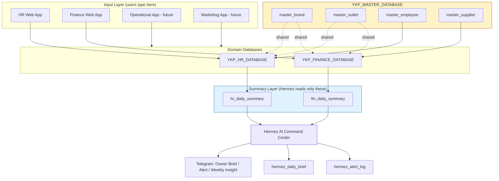

# Architecture, Topology & Governance — YKP Hermez Migration Blueprint

## 1. Executive Summary & Current Status

The YKP Hermez AI Command Center project migrates YKP's HR and Finance operations onto the existing sibling web apps (already built, partially running) and stands up a read-only AI summary layer (Hermez) that produces daily owner briefs, alerts, and weekly insights. The core strategy is **reuse over rebuild**: clone the existing apps into a YKP testing environment, repoint them at fresh YKP-owned databases, fill master data, validate against source-of-truth (Moka, manual ledgers, physical petty cash), then let Hermez consume daily summary sheets — never raw inputs.

| Component | Current State | Next Action |
|---|---|---|
| HR Web App | Exists, running | Clone/configure for YKP; migrate employee masters, shift rules, payroll; test |
| Finance Web App | Exists, not running | Replace DB source; fill YKP data; map brand/outlet/supplier; validate numbers; pilot |
| Operational Web App | Not built / not final | Build after HR + Finance stable. V1: checklist, closing, waste, incident, QC |
| Marketing Web App | Not built | After core finance + operations run. V1: campaign, content calendar, review log |
| Hermez AI Layer | Not running | Activates once `hr_daily_summary` + `fin_daily_summary` exist. Not an input surface |

**Status verdict**: HR is the greenest path (app already running); Finance is the highest-risk migration (app exists but unverified, numbers must reconcile to Moka). Hermez is gated behind both summary sheets being live and validated.

## 2. Project Goals

1. **Reuse** the existing HR and Finance web apps so YKP does not start from zero.
2. **Replace** the legacy dummy/spreadsheet sources with YKP-owned databases — no dummy data in production.
3. **Populate** YKP master data: brand, outlet, employee, supplier, menu, expense categories, petty cash accounts, payroll rules.
4. **Pilot** one brand/outlet for at least 7 days before any multi-outlet rollout.
5. **Prepare a summary layer** (`hr_daily_summary`, `fin_daily_summary`) so Hermez can generate daily brief, alerts, insights, and weekly reports.

## 3. Principles for Developers

- **Never edit the running production app directly.** Clone to a YKP testing environment first; promote only after validation.
- **Never swap a spreadsheet ID without auditing the schema.** Confirm tab names, column names, formulas, and permissions match the app's expectations.
- **Hermez is not an input surface.** All operational input stays in HR / Finance / Operational / Marketing apps. Hermez reads summaries only.
- **Hermez reads summaries, not raw data.** Raw input sheets are off-limits to the AI layer by default.
- **Every finance number must be auditable:** source, timestamp, user/PIC, and receipt/nota where applicable.
- **Start with one pilot brand/outlet**, then roll out to all brands.
- **Stable IDs over display names.** Brand/outlet/employee identity flows via IDs; names are display-only.

## 4. Target Architecture

### 4.1 Topology (text diagram)

```
 HR Web App (running)        Finance Web App (exists, not running)
        |                              |
        v                              v
 YKP_HR_DATABASE              YKP_FINANCE_DATABASE
 (sheets: master_employee,    (sheets: master_brand, master_outlet,
  master_outlet, hr_rules,     master_supplier, fin_categories,
  hr_attendance, hr_payroll)   fin_pos_daily, fin_supplier_cost,
        |                       fin_petty_cash, fin_expense)
        v                              v
 hr_daily_summary             fin_daily_summary
        \                              /
         \                            /
          v                          v
            HERMEZ AI COMMAND CENTER
                      |
                      v
         Telegram Owner Brief / Alert / Weekly Insight
                      |
                      v
         hermez_daily_brief  +  hermez_alert_log
```

Operational and Marketing apps, when built, follow the same shape: **input app → YKP database → `*_daily_summary` → Hermez**. The pattern is the invariant; only the domain changes.

### 4.2 Mermaid diagram



**Read rules** (enforced by sheet permissions, not just convention):

| Layer | Hermez access | App write access |
|---|---|---|
| `YKP_MASTER_DATABASE` | read-only (masters) | HR app / Finance app (shared) |
| `YKP_HR_DATABASE` raw sheets (attendance, payroll) | **denied** | HR app only |
| `YKP_FINANCE_DATABASE` raw sheets (POS, supplier, petty cash, expense) | **denied** | Finance app only |
| `hr_daily_summary` / `fin_daily_summary` | **read-only** — only sheets Hermez reads | HR / Finance app writes; Hermez never writes |
| `hermez_daily_brief` / `hermez_alert_log` | Hermez writes | Hermez only |

## 5. Data Topology Decision

### 5.1 Options considered

| Option | Pros | Cons | Verdict |
|---|---|---|---|
| A. Single `YKP_CENTRAL_DATABASE` workbook | One ID, simplest wiring, easy dev convenience | One giant sheet, permission granularity impossible, HR and Finance apps both write same workbook → accidental cross-contamination risk, quota limits | Rejected for prod; acceptable only as dev convenience |
| B. Three databases: `YKP_MASTER_DATABASE` + `YKP_HR_DATABASE` + `YKP_FINANCE_DATABASE` | Clean separation of concerns, per-domain permissions, independent app ownership, master shared cleanly, blast radius contained | Three IDs to configure; master must be referenced (read) by both domain apps | **Chosen** |

### 5.2 Why split into three

1. **Permission isolation** — HR staff should not have write access to finance sheets; finance staff should not touch HR. A single workbook makes row/cell-level permissions brittle. Splitting lets each domain app hold its own service credentials and grant least-privilege per sheet.
2. **Blast radius** — a formula error or bad import in Finance cannot corrupt HR masters or attendance logs. Each domain's failure is contained to its own database.
3. **Ownership boundary** — HR app owns `YKP_HR_DATABASE`; Finance app owns `YKP_FINANCE_DATABASE`; neither owns `YKP_MASTER_DATABASE` (shared read + controlled-write via a master-management surface). This maps cleanly to app service accounts.
4. **Independent rollout cadence** — HR can stabilize (it already runs) while Finance is still being validated, without touching shared state. The pilot gates operate per-domain.
5. **Single source of truth for masters** — `YKP_MASTER_DATABASE` holds `master_brand`, `master_outlet`, `master_employee`, `master_supplier` exactly once. Both domain databases **reference** master IDs (read) rather than duplicating them, which prevents the "name inconsistency" risk called out in the brief (§14). A single `master_brand` / `master_outlet` is the authoritative reference.
6. **Quota and performance** — Google Sheets / spreadsheet-backed apps hit practical limits on a single workbook; splitting keeps each workbook small and fast.

### 5.3 Reference model

- `master_brand` and `master_outlet` live **only** in `YKP_MASTER_DATABASE`.
- `master_employee` lives in `YKP_MASTER_DATABASE` as the canonical employee record; HR-specific extension columns (shift assignment, payroll config) live in `YKP_HR_DATABASE` keyed by `employee_id`.
- `master_supplier` lives in `YKP_MASTER_DATABASE`.
- Domain databases **read** master IDs; they never rewrite master rows. Writes to masters go through the master-management surface only.

| Database | Sheet | Owner app | Hermez reads? |
|---|---|---|---|
| YKP_MASTER_DATABASE | master_brand | Master mgmt surface | Yes |
| YKP_MASTER_DATABASE | master_outlet | Master mgmt surface | Yes |
| YKP_MASTER_DATABASE | master_employee | Master mgmt surface / HR app | Yes |
| YKP_MASTER_DATABASE | master_supplier | Master mgmt surface / Finance app | Yes |
| YKP_HR_DATABASE | hr_rules | HR app | No (summary only) |
| YKP_HR_DATABASE | hr_attendance | HR app | No (summary only) |
| YKP_HR_DATABASE | hr_payroll | HR app | No (summary only) |
| YKP_HR_DATABASE | hr_daily_summary | HR app writes | **Yes** |
| YKP_FINANCE_DATABASE | fin_categories | Finance app | No |
| YKP_FINANCE_DATABASE | fin_pos_daily | Finance app | No (summary only) |
| YKP_FINANCE_DATABASE | fin_supplier_cost | Finance app | No (summary only) |
| YKP_FINANCE_DATABASE | fin_petty_cash | Finance app | No (summary only) |
| YKP_FINANCE_DATABASE | fin_expense | Finance app | No (summary only) |
| YKP_FINANCE_DATABASE | fin_daily_summary | Finance app writes | **Yes** |
| (Hermez output store) | hermez_daily_brief | Hermez | Yes (own log) |
| (Hermez output store) | hermez_alert_log | Hermez | Yes (own log) |

## 6. Naming Conventions

### 6.1 Stable IDs

- Format: `UPPERCASE_PREFIX-NNN` for human-readable business IDs, or a UUID for internal surrogate keys. Pick one per entity and never change it.
- **Never reuse a display name as a key.** Names change; IDs must not.
- Once assigned, an ID is immutable for the entity's lifetime. Inactive entities are marked `status = inactive`, never deleted or re-ID'd.

| Entity | ID column | Format example | Lifetime |
|---|---|---|---|
| Brand | brand_id | `BR-001` | immutable |
| Outlet | outlet_id | `OL-001` | immutable |
| Employee | employee_id | `EMP-00001` (or UUID) | immutable; survives rehire |
| Supplier | supplier_id | `SUP-0001` | immutable |
| Rule | rule_id | `HRR-OUT-001` (per outlet) | immutable while active |
| Alert | alert_id | `ALT-YYYYMMDD-NNN` | immutable |

**FK rules**: `employee.outlet_id` must resolve to a row in `master_outlet`; `outlet.brand_id` must resolve to `master_brand`; `fin_*.outlet_id` must resolve to `master_outlet`. Mismatches block the write.

### 6.2 Date / Time

| Field | Format | Timezone | Notes |
|---|---|---|---|
| Date columns | `YYYY-MM-DD` | Asia/Jakarta (WIB) | ISO 8601, no slashes |
| Timestamp columns | `YYYY-MM-DD HH:mm:ss` | Asia/Jakarta, stored naive-WIB | Append `Z` only if actually UTC |
| Time-of-day columns | `HH:mm` | 24-hour, Asia/Jakarta | For shift start/end |
| Payroll period | `YYYY-MM` (period) or `YYYY-MM-DD` to `YYYY-MM-DD` range | WIB | Explicit start/end, no "last month" phrasing in data |
| generated_at (Hermez) | `YYYY-MM-DD HH:mm:ss` | WIB | When brief/alert was produced |

**Rule**: one timezone for all YKP data — Asia/Jakarta. If an outlet operates in a different zone (rare for YKP), store the value in WIB and record the source zone in `master_outlet.timezone`; never store local-naive times mixed with WIB-naive times in the same column.

### 6.3 Currency

| Rule | Value |
|---|---|
| Currency | IDR (Rupiah) only for YKP V1 |
| Storage format | integer rupiah, no decimals, no `Rp` prefix, no thousand separators in stored values |
| Display format | `Rp 1.234.567` (Indonesian grouping) in UI; raw integer in data |
| Rounding | round to whole rupiah; no sen (IDR has no subunit) |
| Negative values | allowed only for corrections/refunds; never for revenue totals |
| Column suffix | amount/cost/balance/sales columns end in the unit, e.g. `gross_sales`, `petty_cash_out` — all IDR integers |

**Never** store `"Rp 1.000.000"` as a string in a data cell; the app and Hermez must parse integers. Display formatting belongs in the UI layer only.

## 7. Audit & Permission Rules

### 7.1 Audit trail — every finance number

Per the brief (§3): every finance figure must trace to source, timestamp, PIC, and nota where applicable. This is enforced structurally, not by convention.

| Required audit field | Where stored | Example |
|---|---|---|
| source | row column `source` | `moka` / `manual` / `receipt` |
| source_ref | `source_ref` | Moka trx ID, receipt number, nota no. |
| recorded_at | `recorded_at` | `2026-06-30 21:05:00` (WIB) |
| recorded_by | `recorded_by` | PIC username / telegram_id |
| updated_at | `updated_at` | last edit timestamp |
| receipt_url | `receipt_url` | link to nota image (optional) |

Any finance row missing `source`, `recorded_at`, or `recorded_by` is rejected at write time by the Finance app. The daily summary must be reconstructable from raw rows via these fields.

### 7.2 Hermez no-write-back policy

- Hermez **reads** `hr_daily_summary` and `fin_daily_summary` only.
- Hermez **writes** only to `hermez_daily_brief` and `hermez_alert_log`.
- Hermez **never** edits operational data, triggers transfers, or auto-approves anything. Every action item in a brief requires owner/manager approval (brief §12). This is a hard boundary: even if a future feature requests auto-action, V1 refuses.

### 7.3 Permission matrix

| Role | Master DB | HR DB raw | HR summary | Finance DB raw | Finance summary | Hermez output | Telegram send |
|---|---|---|---|---|---|---|---|
| Owner | read | read | read | read | read | read | receive |
| Manager (outlet) | read | read (own outlet) | read (own outlet) | read (own outlet) | read (own outlet) | — | — |
| HR staff | read | write | read | — | — | — | — |
| Finance staff | read | — | read | write | read | — | — |
| Hermez service account | read (masters) | **denied** | **read-only** | **denied** | **read-only** | write (own) | send |
| Developer (testing env only) | full | full | full | full | full | full | test channel |

- Sheet-level permissions enforce the matrix; do not rely on app-code goodwill.
- The Hermez service account has **no write** to any HR or Finance sheet and **no read** on raw input sheets — only the two summary sheets and the master read set.
- Production credentials are scoped per environment; the testing environment uses separate IDs from production.

### 7.4 Validation gates (audit-friendly)

1. **Pre-migration backup** of any existing database/spreadsheet before schema changes and before rollout.
2. **Nightly reconciliation** during pilot: app totals vs Moka vs physical petty cash vs manual calc. Any variance above tolerance blocks rollout.
3. **Immutable IDs**: re-assigning or reusing an ID is a blocking defect, not a cleanup task.
4. **Dummy-data quarantine**: dummy rows must be detached/removed before production; a single row of dummy data in production fails DoD.

## 8. Cross-cutting invariants

| Invariant | Enforcement |
|---|---|
| Single source of truth for brand/outlet identity | `YKP_MASTER_DATABASE` only; FK checks in domain apps |
| Hermez reads summaries, not raw | Service-account sheet permissions deny raw sheets |
| No dummy in production | DoD gate + nightly reconciliation |
| Every finance number auditable | Required audit columns on every finance row |
| Pilot before rollout | 1 brand/outlet, ≥7 days, variance within tolerance |
| One timezone | Asia/Jakarta across all YKP data |
| Currency integer IDR | No string-formatted currency in data cells |