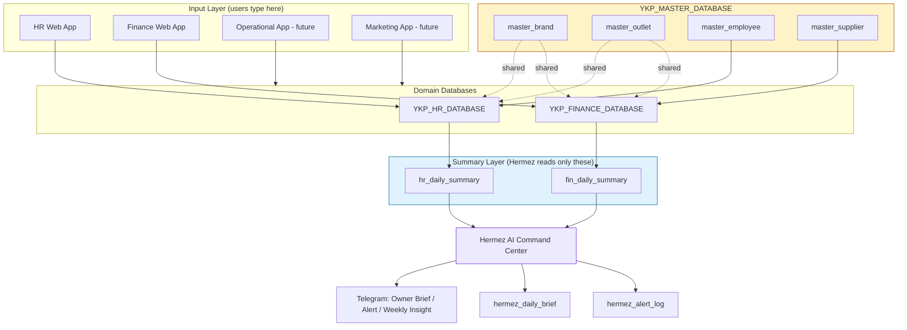

# YKP Hermez Migration Blueprint

**Project:** YKP Hermez AI Command Center  
**Scope:** Migration of HR and Finance operations into YKP-owned systems, plus read-only Hermez AI summary layer.  
**Date:** 2026-06-30  
**Version:** 1.0  
**Audience:** Developers, DevOps, QA, Operations, Finance, HR  

---

# Table of Contents

1. [Context & Current Status](#1-context--current-status)
2. [Project Goals](#2-project-goals)
3. [Principles for Developers](#3-principles-for-developers)
4. [Target Architecture](#4-target-architecture)
5. [Migration Process](#5-migration-process)
6. [HR App Migration (detailed)](#6-hr-app-migration-detailed)
7. [Finance App Migration (detailed)](#7-finance-app-migration-detailed)
8. [Minimal Sheet Structure](#8-minimal-sheet-structure)
9. [Summary Sheet Contracts for Hermez](#9-summary-sheet-contracts-for-hermez)
10. [Hermez AI Command Center Logic](#10-hermez-ai-command-center-logic)
11. [Implementation Roadmap](#11-implementation-roadmap)
12. [Pilot Plan](#12-pilot-plan)
13. [Definition of Done](#13-definition-of-done)
14. [Risks & Mitigations](#14-risks--mitigations)
15. [Short Developer Message / Next Actions](#15-short-developer-message--next-actions)
- [Appendix A: Google Sheets Formula Examples](#appendix-a-google-sheets-formula-examples)
- [Appendix B: Environment Variables & Secrets](#appendix-b-environment-variables--secrets)

---

# 1. Context & Current Status

The YKP Hermez AI Command Center project migrates YKP's HR and Finance operations onto existing sibling web apps and stands up a read-only AI summary layer (Hermez) that produces daily owner briefs, alerts, and weekly insights. The core strategy is **reuse over rebuild**: clone the existing apps into a YKP testing environment, repoint them at fresh YKP-owned databases, fill master data, validate against source-of-truth (Moka, manual ledgers, physical petty cash), then let Hermez consume daily summary sheets — never raw inputs.

| Component | Current State | Next Action |
|---|---|---|
| HR Web App | Exists, running | Clone/configure for YKP; migrate employee masters, shift rules, payroll; test |
| Finance Web App | Exists, not running | Replace DB source; fill YKP data; map brand/outlet/supplier; validate numbers; pilot |
| Operational Web App | Not built / not final | Build after HR + Finance stable. V1: checklist, closing, waste, incident, QC |
| Marketing Web App | Not built | After core finance + operations run. V1: campaign, content calendar, review log |
| Hermez AI Layer | Not running | Activates once `hr_daily_summary` + `fin_daily_summary` exist. Not an input surface |

**Status verdict**: HR is the greenest path (app already running); Finance is the highest-risk migration (app exists but unverified, numbers must reconcile to Moka). Hermez is gated behind both summary sheets being live and validated.

---

# 2. Project Goals

1. **Reuse** the existing HR and Finance web apps so YKP does not start from zero.
2. **Replace** the legacy dummy/spreadsheet sources with YKP-owned databases — no dummy data in production.
3. **Populate** YKP master data: brand, outlet, employee, supplier, menu, expense categories, petty cash accounts, payroll rules.
4. **Pilot** one brand/outlet for at least 7 days before any multi-outlet rollout.
5. **Prepare a summary layer** (`hr_daily_summary`, `fin_daily_summary`) so Hermez can generate daily brief, alerts, insights, and weekly reports.

---

# 3. Principles for Developers

- **Never edit the running production app directly.** Clone to a YKP testing environment first; promote only after validation.
- **Never swap a spreadsheet ID without auditing the schema.** Confirm tab names, column names, formulas, and permissions match the app's expectations.
- **Hermez is not an input surface.** All operational input stays in HR / Finance / Operational / Marketing apps. Hermez reads summaries only.
- **Hermez reads summaries, not raw data.** Raw input sheets are off-limits to the AI layer by default.
- **Every finance number must be auditable:** source, timestamp, user/PIC, and receipt/nota where applicable.
- **Start with one pilot brand/outlet**, then roll out to all brands.
- **Stable IDs over display names.** Brand/outlet/employee identity flows via IDs; names are display-only.
- **One timezone:** Asia/Jakarta (WIB) for all stored dates and times.
- **Currency integer IDR:** no decimals, no `Rp` prefix, no thousand separators in stored values.
- **No dummy data in production.** Every row must map to a real YKP entity or be explicitly quarantined.

---

# 4. Target Architecture

## 4.1 Topology (text diagram)

```
 HR Web App (running)        Finance Web App (exists, not running)
        |                              |
        v                              v
 YKP_HR_DATABASE              YKP_FINANCE_DATABASE
 (sheets: master_employee,    (sheets: master_brand, master_outlet,
  master_outlet, hr_rules,     master_supplier, fin_categories,
  hr_attendance, hr_payroll)   fin_pos_daily, fin_supplier_cost,
        |                       fin_petty_cash, fin_expense)
        v                              v
 hr_daily_summary             fin_daily_summary
        \                              /
         \                            /
          v                          v
            HERMEZ AI COMMAND CENTER
                      |
                      v
         Telegram Owner Brief / Alert / Weekly Insight
                      |
                      v
         hermez_daily_brief  +  hermez_alert_log
```

Operational and Marketing apps, when built, follow the same shape: **input app → YKP database → `*_daily_summary` → Hermez**. The pattern is the invariant; only the domain changes.

## 4.2 Mermaid diagram



## 4.3 Data topology decision

### 4.3.1 Options considered

| Option | Pros | Cons | Verdict |
|---|---|---|---|
| A. Single `YKP_CENTRAL_DATABASE` workbook | One ID, simplest wiring, easy dev convenience | One giant sheet, permission granularity impossible, HR and Finance apps both write same workbook → accidental cross-contamination risk, quota limits | Rejected for prod; acceptable only as dev convenience |
| B. Three databases: `YKP_MASTER_DATABASE` + `YKP_HR_DATABASE` + `YKP_FINANCE_DATABASE` | Clean separation of concerns, per-domain permissions, independent app ownership, master shared cleanly, blast radius contained | Three IDs to configure; master must be referenced (read) by both domain apps | **Chosen** |

### 4.3.2 Why split into three

1. **Permission isolation** — HR staff should not have write access to finance sheets; finance staff should not touch HR. A single workbook makes row/cell-level permissions brittle. Splitting lets each domain app hold its own service credentials and grant least-privilege per sheet.
2. **Blast radius** — a formula error or bad import in Finance cannot corrupt HR masters or attendance logs. Each domain's failure is contained to its own database.
3. **Ownership boundary** — HR app owns `YKP_HR_DATABASE`; Finance app owns `YKP_FINANCE_DATABASE`; neither owns `YKP_MASTER_DATABASE` (shared read + controlled-write via a master-management surface). This maps cleanly to app service accounts.
4. **Independent rollout cadence** — HR can stabilize (it already runs) while Finance is still being validated, without touching shared state. The pilot gates operate per-domain.
5. **Single source of truth for masters** — `YKP_MASTER_DATABASE` holds `master_brand`, `master_outlet`, `master_employee`, `master_supplier` exactly once. Both domain databases **reference** master IDs (read) rather than duplicating them, which prevents the "name inconsistency" risk. A single `master_brand` / `master_outlet` is the authoritative reference.
6. **Quota and performance** — Google Sheets / spreadsheet-backed apps hit practical limits on a single workbook; splitting keeps each workbook small and fast.

### 4.3.3 Reference model

- `master_brand` and `master_outlet` live **only** in `YKP_MASTER_DATABASE`.
- `master_employee` lives in `YKP_MASTER_DATABASE` as the canonical employee record; HR-specific extension columns (shift assignment, payroll config) live in `YKP_HR_DATABASE` keyed by `employee_id`.
- `master_supplier` lives in `YKP_MASTER_DATABASE`.
- Domain databases **read** master IDs; they never rewrite master rows. Writes to masters go through the master-management surface only.

| Database | Sheet | Owner app | Hermez reads? |
|---|---|---|---|
| YKP_MASTER_DATABASE | master_brand | Master mgmt surface | Yes |
| YKP_MASTER_DATABASE | master_outlet | Master mgmt surface | Yes |
| YKP_MASTER_DATABASE | master_employee | Master mgmt surface / HR app | Yes |
| YKP_MASTER_DATABASE | master_supplier | Master mgmt surface / Finance app | Yes |
| YKP_HR_DATABASE | hr_rules | HR app | No (summary only) |
| YKP_HR_DATABASE | hr_attendance | HR app | No (summary only) |
| YKP_HR_DATABASE | hr_payroll | HR app | No (summary only) |
| YKP_HR_DATABASE | hr_daily_summary | HR app writes | **Yes** |
| YKP_FINANCE_DATABASE | fin_categories | Finance app | No |
| YKP_FINANCE_DATABASE | fin_pos_daily | Finance app | No (summary only) |
| YKP_FINANCE_DATABASE | fin_supplier_cost | Finance app | No (summary only) |
| YKP_FINANCE_DATABASE | fin_petty_cash | Finance app | No (summary only) |
| YKP_FINANCE_DATABASE | fin_expense | Finance app | No (summary only) |
| YKP_FINANCE_DATABASE | fin_daily_summary | Finance app writes | **Yes** |
| (Hermez output store) | hermez_daily_brief | Hermez | Yes (own log) |
| (Hermez output store) | hermez_alert_log | Hermez | Yes (own log) |

## 4.4 Read rules

Read rules are enforced by sheet permissions, not just convention:

| Layer | Hermez access | App write access |
|---|---|---|
| `YKP_MASTER_DATABASE` | read-only (masters) | HR app / Finance app (shared) |
| `YKP_HR_DATABASE` raw sheets (attendance, payroll) | **denied** | HR app only |
| `YKP_FINANCE_DATABASE` raw sheets (POS, supplier, petty cash, expense) | **denied** | Finance app only |
| `hr_daily_summary` / `fin_daily_summary` | **read-only** — only sheets Hermez reads | HR / Finance app writes; Hermez never writes |
| `hermez_daily_brief` / `hermez_alert_log` | Hermez writes | Hermez only |

## 4.5 Naming conventions

### 4.5.1 Stable IDs

- Format: `UPPERCASE_PREFIX-NNN` for human-readable business IDs, or a UUID for internal surrogate keys. Pick one per entity and never change it.
- **Never reuse a display name as a key.** Names change; IDs must not.
- Once assigned, an ID is immutable for the entity's lifetime. Inactive entities are marked `status = inactive`, never deleted or re-ID'd.

| Entity | ID column | Format example | Lifetime |
|---|---|---|---|
| Brand | brand_id | `BR-001` | immutable |
| Outlet | outlet_id | `OL-001` | immutable |
| Employee | employee_id | `EMP-00001` (or UUID) | immutable; survives rehire |
| Supplier | supplier_id | `SUP-0001` | immutable |
| Rule | rule_id | `HRR-OUT-001` (per outlet) | immutable while active |
| Alert | alert_id | `ALT-YYYYMMDD-NNN` | immutable |

**FK rules**: `employee.outlet_id` must resolve to a row in `master_outlet`; `outlet.brand_id` must resolve to `master_brand`; `fin_*.outlet_id` must resolve to `master_outlet`. Mismatches block the write.

### 4.5.2 Date / Time

| Field | Format | Timezone | Notes |
|---|---|---|---|
| Date columns | `YYYY-MM-DD` | Asia/Jakarta (WIB) | ISO 8601, no slashes |
| Timestamp columns | `YYYY-MM-DD HH:mm:ss` | Asia/Jakarta, stored naive-WIB | Append `Z` only if actually UTC |
| Time-of-day columns | `HH:mm` | 24-hour, Asia/Jakarta | For shift start/end |
| Payroll period | `YYYY-MM` (period) or `YYYY-MM-DD` to `YYYY-MM-DD` range | WIB | Explicit start/end, no "last month" phrasing in data |
| generated_at (Hermez) | `YYYY-MM-DD HH:mm:ss` | WIB | When brief/alert was produced |

**Rule**: one timezone for all YKP data — Asia/Jakarta. If an outlet operates in a different zone (rare for YKP), store the value in WIB and record the source zone in `master_outlet.timezone`; never store local-naive times mixed with WIB-naive times in the same column.

### 4.5.3 Currency

| Rule | Value |
|---|---|
| Currency | IDR (Rupiah) only for YKP V1 |
| Storage format | integer rupiah, no decimals, no `Rp` prefix, no thousand separators in stored values |
| Display format | `Rp 1.234.567` (Indonesian grouping) in UI; raw integer in data |
| Rounding | round to whole rupiah; no sen (IDR has no subunit) |
| Negative values | allowed only for corrections/refunds; never for revenue totals |
| Column suffix | amount/cost/balance/sales columns end in the unit, e.g. `gross_sales`, `petty_cash_out` — all IDR integers |

**Never** store `"Rp 1.000.000"` as a string in a data cell; the app and Hermez must parse integers. Display formatting belongs in the UI layer only.

## 4.6 Audit & permission rules

### 4.6.1 Audit trail — every finance number

Every finance figure must trace to source, timestamp, PIC, and nota where applicable. This is enforced structurally, not by convention.

| Required audit field | Where stored | Example |
|---|---|---|
| source | row column `source` | `moka` / `manual` / `receipt` |
| source_ref | `source_ref` | Moka trx ID, receipt number, nota no. |
| recorded_at | `recorded_at` | `2026-06-30 21:05:00` (WIB) |
| recorded_by | `recorded_by` | PIC username / telegram_id |
| updated_at | `updated_at` | last edit timestamp |
| receipt_url | `receipt_url` | link to nota image (optional) |

Any finance row missing `source`, `recorded_at`, or `recorded_by` is rejected at write time by the Finance app. The daily summary must be reconstructable from raw rows via these fields.

### 4.6.2 Hermez no-write-back policy

- Hermez **reads** `hr_daily_summary` and `fin_daily_summary` only.
- Hermez **writes** only to `hermez_daily_brief` and `hermez_alert_log`.
- Hermez **never** edits operational data, triggers transfers, or auto-approves anything. Every action item in a brief requires owner/manager approval. This is a hard boundary: even if a future feature requests auto-action, V1 refuses.

### 4.6.3 Permission matrix

| Role | Master DB | HR DB raw | HR summary | Finance DB raw | Finance summary | Hermez output | Telegram send |
|---|---|---|---|---|---|---|---|
| Owner | read | read | read | read | read | read | receive |
| Manager (outlet) | read | read (own outlet) | read (own outlet) | read (own outlet) | read (own outlet) | — | — |
| HR staff | read | write | read | — | — | — | — |
| Finance staff | read | — | read | write | read | — | — |
| Hermez service account | read (masters) | **denied** | **read-only** | **denied** | **read-only** | write (own) | send |
| Developer (testing env only) | full | full | full | full | full | full | test channel |

- Sheet-level permissions enforce the matrix; do not rely on app-code goodwill.
- The Hermez service account has **no write** to any HR or Finance sheet and **no read** on raw input sheets — only the two summary sheets and the master read set.
- Production credentials are scoped per environment; the testing environment uses separate IDs from production.

### 4.6.4 Validation gates (audit-friendly)

1. **Pre-migration backup** of any existing database/spreadsheet before schema changes and before rollout.
2. **Nightly reconciliation** during pilot: app totals vs Moka vs physical petty cash vs manual calc. Any variance above tolerance blocks rollout.
3. **Immutable IDs**: re-assigning or reusing an ID is a blocking defect, not a cleanup task.
4. **Dummy-data quarantine**: dummy rows must be detached/removed before production; a single row of dummy data in production fails DoD.

## 4.7 Cross-cutting invariants

| Invariant | Enforcement |
|---|---|
| Single source of truth for brand/outlet identity | `YKP_MASTER_DATABASE` only; FK checks in domain apps |
| Hermez reads summaries, not raw | Service-account sheet permissions deny raw sheets |
| No dummy in production | DoD gate + nightly reconciliation |
| Every finance number auditable | Required audit columns on every finance row |
| Pilot before rollout | 1 brand/outlet, ≥7 days, variance within tolerance |
| One timezone | Asia/Jakarta across all YKP data |
| Currency integer IDR | No string-formatted currency in data cells |

---

# 5. Migration Process

The migration follows a repeatable, per-domain pattern:

| Phase | HR | Finance | Gate |
|---|---|---|---|
| 1. Clone | Copy HR app to YKP testing environment | Copy Finance app to YKP testing environment | App loads; no production impact |
| 2. Repoint | Connect to `YKP_HR_DATABASE` | Connect to `YKP_FINANCE_DATABASE` | Read/write verified |
| 3. Clean | Remove all dummy/demo data | Remove all dummy/demo data | No orphan rows |
| 4. Fill masters | `master_brand`, `master_outlet`, `master_employee` | `master_brand`, `master_outlet`, `master_supplier`, categories, payment methods, petty cash accounts | FK integrity passes |
| 5. Configure rules | `hr_rules` per outlet | Opening balances, expense categories, payment methods | Rules visible in app |
| 6. Seed transactions | Sample attendance + payroll | Sample POS, supplier, petty cash, expense rows | Matches source documents |
| 7. Validate | Attendance/payroll reconcile to manual list | Dashboard numbers reconcile to Moka/manual P&L | Within tolerance |
| 8. Pilot | 1 outlet, 7 days real staff | 1 brand/outlet, 7 days live transactions | Daily validation passes |
| 9. Summary | Build `hr_daily_summary` | Build `fin_daily_summary` | Hermez can read |
| 10. Rollout | Outlet-by-outlet | Brand-by-brand | Each passes 1-day smoke test |

**Cross-domain dependency**: Hermez can be wired after step 9 for both domains. Do not activate Hermez before both summary sheets exist and are validated.

---

# 6. HR App Migration (detailed)

## 6.1 master_employee schema

| Column | Type | Required | Notes |
|---|---|---|---|
| employee_id | text / UUID | Y | Unique ID, stable across systems |
| full_name | text | Y | Display name |
| role | text | Y | e.g. barista, cook, supervisor, manager |
| outlet_id | text | Y | FK to master_outlet |
| brand_id | text | Y | Denormalized for summary filters |
| phone | text | N | WhatsApp / SMS contact |
| telegram_id | text | N | For Hermez alert routing |
| employment_type | text | Y | full_time / part_time / contract |
| join_date | date | Y | Payroll prorate baseline |
| base_salary | number | Y | Monthly gross (Rp) |
| status | text | Y | active / inactive / terminated |

## 6.2 master_outlet mapping

| Column | Type | Required | Notes |
|---|---|---|---|
| outlet_id | text | Y | Unique ID |
| brand_id | text | Y | FK to master_brand |
| outlet_name | text | Y | Display name |
| location | text | N | City / address |
| timezone | text | Y | Default Asia/Jakarta |
| opening_time | time | N | Earliest shift start |
| closing_time | time | N | Latest shift end |
| status | text | Y | active / closed / test |

**Mapping rule**: every `employee.outlet_id` must exist in `master_outlet.outlet_id`. One employee maps to exactly one outlet at a time; multi-outlet staff need a primary outlet + secondary assignment log.

## 6.3 hr_rules schema

| Column | Type | Required | Notes |
|---|---|---|---|
| rule_id | text | Y | Unique ID |
| outlet_id | text | Y | Rule scope |
| shift_name | text | Y | morning / afternoon / full_day |
| shift_start | time | Y | Expected check-in |
| shift_end | time | Y | Expected check-out |
| late_tolerance_minutes | int | Y | e.g. 10 |
| overtime_rate_multiplier | number | Y | e.g. 1.5 for first 4h, 2.0 after |
| overtime_daily_cap_hours | number | N | e.g. 4 |
| early_clockin_tolerance_min | int | N | Prevent gaming the clock |
| mandatory_checkout | boolean | Y | true requires end-of-day check-out |
| payroll_period_start | int | Y | 1–31 day of month |
| payroll_period_end | int | Y | e.g. 31 |

## 6.4 hr_attendance schema

| Column | Type | Required | Notes |
|---|---|---|---|
| attendance_id | text | Y | Unique ID |
| date | date | Y | Work date (Asia/Jakarta) |
| employee_id | text | Y | FK to master_employee |
| outlet_id | text | Y | Outlet worked |
| shift_name | text | Y | FK to hr_rules.shift_name |
| check_in | datetime | Y | Actual check-in |
| check_out | datetime | N | Missing = open attendance |
| check_in_location | text | N | Optional geotag |
| check_out_location | text | N | Optional geotag |
| is_late | boolean | Y | Computed from rule |
| late_minutes | int | N | 0 if on time |
| is_early_leave | boolean | N | True if check_out < shift_end |
| overtime_hours | number | N | Computed from rule |
| attendance_status | text | Y | present / absent / izin / sakit / cuti |
| approved_by | text | N | Manager/supervisor ID |
| notes | text | N | Free text |

## 6.5 Payroll calculation formulas

**Base period definition**

```
payroll_days = DATEDIFF(payroll_period_start, payroll_period_end) + 1
```

**Daily prorated salary**

```
daily_rate = base_salary / payroll_days
```

**Attendance proration**

```
attendance_count = COUNT(hr_attendance WHERE employee_id = X
                                          AND date IN period
                                          AND status IN ('present','izin','sakit'))
absent_days      = payroll_days - attendance_count
attendance_deduction = absent_days * daily_rate
```

**Late deduction (configurable per outlet)**

```
late_deduction = IF(late_minutes_total_in_period > 60,
                    FLOOR(late_minutes_total / 60) * hourly_late_penalty,
                    0)
```

**Overtime pay**

```
regular_hourly_rate  = base_salary / (payroll_days * shift_hours)
overtime_first_block = MIN(overtime_hours, 4) * regular_hourly_rate * 1.5
overtime_next_block  = MAX(overtime_hours - 4, 0) * regular_hourly_rate * 2.0
overtime_pay         = overtime_first_block + overtime_next_block
```

**Gross salary**

```
gross_salary = (attendance_count * daily_rate)
               + overtime_pay
               + bonus
               - attendance_deduction
               - late_deduction
               - other_deductions
```

**Net salary estimate**

```
net_salary = gross_salary - (gross_salary * tax_estimate_pct) - employee_benefits
```

### 6.5.1 Example: Barista “Ayu” at outlet OL-001

| Item | Value |
|---|---|
| Base salary | Rp 4,500,000 |
| Payroll period | 1–30 Jun 2026 (30 days) |
| Daily rate | Rp 150,000 |
| Present days | 26 |
| Izin (paid) | 2 |
| Absent | 2 |
| Total late minutes | 75 |
| Hourly late penalty | Rp 18,750 |
| Overtime hours | 5 |
| Regular shift hours | 8 |
| Hourly rate | Rp 18,750 |
| Bonus | Rp 250,000 |

| Calculation | Amount |
|---|---|
| Attendance base | 28 × Rp 150,000 = Rp 4,200,000 |
| Absent deduction | 2 × Rp 150,000 = -Rp 300,000 |
| Late deduction | 75 min = 1.25h → 1h × Rp 18,750 = -Rp 18,750 |
| Overtime pay | (4 × Rp 18,750 × 1.5) + (1 × Rp 18,750 × 2.0) = Rp 150,000 |
| Bonus | +Rp 250,000 |
| **Gross salary** | **Rp 4,281,250** |

## 6.6 Step-by-step migration task list

| Step | Task | Owner | Verification |
|---|---|---|---|
| 1 | Clone HR app to YKP testing environment | Dev | App loads with no live data |
| 2 | Connect app to YKP_HR_DATABASE or YKP_CENTRAL_DATABASE HR tab | Dev | App reads/writes new spreadsheet |
| 3 | Fill master_brand and master_outlet for all YKP brands/outlets | Data | No orphan employees |
| 4 | Fill master_employee with current roster | Data | 1:1 match with existing payroll list |
| 5 | Configure hr_rules per outlet (shift, tolerance, overtime, period) | Ops + Dev | Rules visible in app admin panel |
| 6 | Test attendance: check-in, check-out, late, izin, missing checkout | QA | All statuses computed correctly |
| 7 | Test payroll on 3–5 sample employees | QA + Finance | Compare to manual spreadsheet |
| 8 | Reconcile mismatches and adjust formulas/config | Dev | Variance ≤ Rp 1,000 per employee |
| 9 | Pilot 1 outlet for 7 days with real staff | Ops | Daily attendance closes cleanly |
| 10 | Rollout to remaining outlets | Ops + Dev | Each outlet passes 1-day smoke test |

## 6.7 Validation checklist

| # | Check | Pass criteria |
|---|---|---|
| 1 | Schema validation | master_employee, master_outlet, hr_rules, hr_attendance exist and all required columns populated |
| 2 | Referential integrity | Every employee has valid outlet_id and brand_id |
| 3 | Shift rule coverage | Every active outlet has at least one shift rule |
| 4 | Attendance closure | No open check-out older than 48 hours at end of day |
| 5 | Late detection | Late flagged within tolerance and minutes counted |
| 6 | Overtime math | Overtime hours match clock-out minus shift_end, capped by rule |
| 7 | Payroll reconciliation | App gross == manual gross for 3–5 sample employees |
| 8 | Summary output | hr_daily_summary populated with correct staff counts |
| 9 | Pilot sign-off | Outlet manager confirms numbers match reality for 7 days |
| 10 | Backup before rollout | Snapshot of YKP_HR_DATABASE taken and stored |

## 6.8 Common failure modes

| Failure | Likely cause | Fix |
|---|---|---|
| Clock-in recorded on wrong date | Timezone set to UTC instead of Asia/Jakarta | Force Asia/Jakarta in app and database |
| Missing checkout flagged as present | `mandatory_checkout=false` or missing rule | Set mandatory_checkout=true per outlet |
| Payroll variance > Rp 10,000 | Wrong payroll_days or prorate formula | Reconcile period length and daily_rate |
| Overtime not calculated | `shift_end` or `overtime_rate_multiplier` empty | Audit hr_rules completeness |
| Employee appears at wrong outlet | master_outlet.outlet_id mismatch | Use master_outlet as single source of truth |
| Summary shows duplicate staff | employee_id not unique or rehired with same phone | Add unique constraint on employee_id |
| Late tolerance ignored | Rule not linked to outlet/shift combination | Add composite key (outlet_id, shift_name) |
| Rollout breaks existing pilot | Production database still points to test sheet | Use environment-specific spreadsheet IDs |
| Hermez reads stale data | hr_daily_summary not refreshed after attendance close | Schedule daily close + summary refresh job |

---

# 7. Finance App Migration (detailed)

## 7.1 Objective

Migrate the existing Finance Web App from its dummy/demo environment into a YKP-dedicated environment, connect it to the YKP Finance database, and validate dashboard numbers against Moka/manual sources before piloting at one brand/outlet.

## 7.2 Master data schemas

### 7.2.1 master_brand

| Column | Type | Description |
|--------|------|-------------|
| `brand_id` | string / UUID | Unique brand identifier. |
| `brand_name` | string | Display name of the brand. |
| `status` | enum: active / inactive | Whether the brand is operational. |
| `created_at` | timestamp | Record creation time. |
| `updated_at` | timestamp | Last update time. |

### 7.2.2 master_outlet

| Column | Type | Description |
|--------|------|-------------|
| `outlet_id` | string / UUID | Unique outlet identifier. |
| `brand_id` | FK → `master_brand.brand_id` | Parent brand. |
| `outlet_name` | string | Display name of the outlet. |
| `location` | string | Address or area label. |
| `status` | enum: active / inactive | Outlet operational flag. |
| `created_at` | timestamp | Record creation time. |
| `updated_at` | timestamp | Last update time. |

### 7.2.3 master_supplier

| Column | Type | Description |
|--------|------|-------------|
| `supplier_id` | string / UUID | Unique supplier identifier. |
| `supplier_name` | string | Supplier display name. |
| `category` | string | Ingredient, packaging, logistics, etc. |
| `contact` | string | Phone or email. |
| `bank_account` | string | Optional account details. |
| `status` | enum: active / inactive | Whether supplier is still used. |
| `created_at` | timestamp | Record creation time. |
| `updated_at` | timestamp | Last update time. |

### 7.2.4 Finance categories

#### 7.2.4.1 fin_expense_category

| Column | Type | Description |
|--------|------|-------------|
| `category_id` | string / UUID | Unique category identifier. |
| `category_name` | string | Human-readable name (electricity, rent, marketing, etc.). |
| `account_type` | enum: OPEX / CAPEX / COGS / OTHER | Grouping for P&L. |
| `status` | enum: active / inactive | Operational flag. |

#### 7.2.4.2 fin_payment_method

| Column | Type | Description |
|--------|------|-------------|
| `method_id` | string / UUID | Unique method identifier. |
| `method_name` | string | Cash, debit card, QRIS, transfer, etc. |
| `is_cash` | boolean | True if method affects physical cash count. |
| `status` | enum: active / inactive | Operational flag. |

#### 7.2.4.3 fin_petty_cash_account

| Column | Type | Description |
|--------|------|-------------|
| `account_id` | string / UUID | Unique petty-cash account identifier. |
| `outlet_id` | FK → `master_outlet.outlet_id` | Outlet the cash belongs to. |
| `account_name` | string | Label (e.g., "Petty Cash — Outlet A"). |
| `currency` | string | Default `IDR`. |
| `status` | enum: active / inactive | Operational flag. |

### 7.2.5 fin_opening_balance

| Column | Type | Description |
|--------|------|-------------|
| `balance_id` | string / UUID | Unique balance record identifier. |
| `outlet_id` | FK → `master_outlet.outlet_id` | Outlet scope. |
| `effective_date` | date | Date the balance applies. |
| `cash_balance` | decimal | Cash-on-hand starting balance. |
| `petty_cash_balance` | decimal | Petty cash starting balance. |
| `unpaid_supplier_opening` | decimal | Supplier debt carried forward. |
| `receivable_opening` | decimal | Optional customer receivables. |
| `notes` | text | Supporting notes / evidence references. |
| `recorded_by` | string | PIC / user who entered it. |
| `created_at` | timestamp | Record creation time. |

## 7.3 Transaction schemas

### 7.3.1 fin_pos_daily

| Column | Type | Description |
|--------|------|-------------|
| `pos_id` | string / UUID | Unique daily record identifier. |
| `date` | date | Transaction date. |
| `brand_id` | FK → `master_brand.brand_id` | Brand scope. |
| `outlet_id` | FK → `master_outlet.outlet_id` | Outlet scope. |
| `gross_sales` | decimal | Total gross sales before discounts/refunds. |
| `net_sales` | decimal | Gross sales minus discounts and refunds. |
| `transaction_count` | integer | Number of transactions. |
| `discount_total` | decimal | Total discounts applied. |
| `refund_total` | decimal | Total refunds. |
| `payment_method_breakdown` | JSON / sub-table | Optional per-method split. |
| `source` | enum: Moka / manual / import | Origin of the data. |
| `imported_at` | timestamp | When the row was imported. |
| `verified_by` | string | PIC who validated the numbers. |

### 7.3.2 fin_supplier_cost

| Column | Type | Description |
|--------|------|-------------|
| `cost_id` | string / UUID | Unique cost record identifier. |
| `date` | date | Invoice or transaction date. |
| `supplier_id` | FK → `master_supplier.supplier_id` | Supplier reference. |
| `brand_id` | FK → `master_brand.brand_id` | Brand scope. |
| `outlet_id` | FK → `master_outlet.outlet_id` | Outlet scope if applicable. |
| `invoice_number` | string | Supplier invoice / nota number. |
| `amount` | decimal | Total supplier cost. |
| `paid_amount` | decimal | Amount already paid. |
| `unpaid_amount` | decimal | `amount - paid_amount`. |
| `due_date` | date | Payment due date. |
| `status` | enum: paid / partial / unpaid | Payment state. |
| `attachment_url` | string | Link to nota/invoice image. |
| `recorded_by` | string | PIC. |
| `created_at` | timestamp | Record creation time. |

### 7.3.3 fin_petty_cash

| Column | Type | Description |
|--------|------|-------------|
| `pc_id` | string / UUID | Unique transaction identifier. |
| `date` | date | Transaction date. |
| `outlet_id` | FK → `master_outlet.outlet_id` | Outlet scope. |
| `account_id` | FK → `fin_petty_cash_account.account_id` | Petty-cash account. |
| `type` | enum: in / out | Direction of cash movement. |
| `amount` | decimal | Transaction amount (always positive). |
| `category_id` | FK → `fin_expense_category.category_id` | Expense category. |
| `description` | text | What the cash was used for. |
| `attachment_url` | string | Optional nota/photo evidence. |
| `recorded_by` | string | PIC. |
| `created_at` | timestamp | Record creation time. |

### 7.3.4 fin_expense

| Column | Type | Description |
|--------|------|-------------|
| `expense_id` | string / UUID | Unique expense identifier. |
| `date` | date | Expense date. |
| `brand_id` | FK → `master_brand.brand_id` | Brand scope. |
| `outlet_id` | FK → `master_outlet.outlet_id` | Outlet scope. |
| `category_id` | FK → `fin_expense_category.category_id` | Expense category. |
| `amount` | decimal | Expense amount. |
| `payment_method_id` | FK → `fin_payment_method.method_id` | How it was paid. |
| `description` | text | Supporting details. |
| `attachment_url` | string | Nota/receipt image. |
| `recorded_by` | string | PIC. |
| `created_at` | timestamp | Record creation time. |

## 7.4 Dashboard formulas

| Metric | Formula | Source Tables |
|--------|---------|---------------|
| **Revenue** | `SUM(net_sales)` for selected date/brand/outlet | `fin_pos_daily` |
| **Expense** | `SUM(amount)` where `payment_method` is recorded in `fin_expense` | `fin_expense` |
| **Supplier Cost** | `SUM(amount)` for the period in `fin_supplier_cost` | `fin_supplier_cost` |
| **Petty Cash Out** | `SUM(amount)` from `fin_petty_cash` where `type = 'out'` | `fin_petty_cash` |
| **Unpaid Supplier** | `SUM(unpaid_amount)` where `status != 'paid'` | `fin_supplier_cost` |
| **Cash Difference** | `(opening_cash + cash_revenue_in - cash_expense_out - petty_cash_out) - physical_cash_count` | `fin_opening_balance`, `fin_pos_daily` (cash methods), `fin_expense`, `fin_petty_cash`, closing count |
| **Net Profit Estimate** | `Revenue - Expense - Supplier Cost - Petty Cash Out` | All of the above |

Notes:
- Cash-revenue-in should be derived from the payment-method breakdown of `fin_pos_daily` for methods where `is_cash = true`.
- Cash-expense-out should be derived from `fin_expense` for payment methods where `is_cash = true`.
- Physical cash count is entered at daily closing and is not stored in the schemas above; the difference formula relies on an additional closing-cash input.

## 7.5 Migration task list

| # | Task | Owner | Output / Gate |
|---|------|-------|---------------|
| 1 | Clone Finance app to YKP testing environment | DevOps / Developer | Separate app instance with no production impact. |
| 2 | Connect cloned app to `YKP_FINANCE_DATABASE` or Finance tabs in `YKP_CENTRAL_DATABASE` | Backend Developer | Verified read/write connection. |
| 3 | Remove or detach all dummy/demo data from the cloned instance | Backend Developer | No dummy brand/outlet/supplier/transaction remains. |
| 4 | Fill master data: brand, outlet, supplier, finance categories, payment methods, petty-cash accounts | Data / Operations | Master sheets fully populated and cross-referenced. |
| 5 | Enter opening balances: cash, petty cash, supplier debt, receivables | Finance / Operations | Signed-off opening balances per outlet. |
| 6 | Import sample POS data from Moka for 3–7 days | Backend / Data | `fin_pos_daily` rows match Moka report. |
| 7 | Input sample supplier costing, petty cash, and expense transactions with notas | Operations / Finance | All sample rows have evidence links. |
| 8 | Validate dashboard formulas: revenue, expense, supplier cost, petty cash, unpaid supplier, cash difference, net profit | QA / Finance | Variance vs. manual calculation within tolerance. |
| 9 | Pilot finance live for 1 brand / 1 outlet for 7 days | Operations | Daily validation passes; issues logged and fixed. |
| 10 | Prepare `fin_daily_summary` for Hermez consumption | Backend Developer | Summary sheet contract satisfied. |

## 7.6 Daily validation against Moka / manual records

| Step | Action | Evidence / Tolerance |
|------|--------|---------------------|
| 1 | Export Moka daily sales report (gross sales, net sales, transaction count, discounts, refunds). | Source file from Moka dashboard. |
| 2 | Compare each row in `fin_pos_daily` to the Moka report for the same `date` + `outlet_id`. | Allowable variance ≤ 1% or Rp 10,000, whichever is larger. |
| 3 | Reconcile supplier invoices against `fin_supplier_cost` `amount` and `unpaid_amount`. | Match invoice number + photo evidence. |
| 4 | Count physical petty cash and compare with `(opening_petty_cash + petty_cash_in - petty_cash_out)`. | Variance ≤ Rp 5,000 or must be explained. |
| 5 | Count physical cash register and compare with cash formula. | Variance = cash_difference column. |
| 6 | Spot-check `fin_expense` rows against saved notas/photos. | 100% of sample rows must have attachments. |
| 7 | Run dashboard formulas and compare net profit estimate to a manually reconstructed P&L. | Variance ≤ 2%. |
| 8 | If any step fails, stop rollout, log the mismatch, fix root cause, and re-validate. | Pass gate before continuing. |

## 7.7 Rollout gate

Finance App migration is considered done when:
- Cloned app runs against YKP data with no dummy records.
- Dashboard numbers match Moka/manual sources within the tolerances above.
- 7-day pilot at one brand/outlet completes with no unresolved cash differences or supplier mismatches.
- `fin_daily_summary` is produced daily and readable by Hermez.
- Backup of pre-migration and pre-rollout database/spreadsheet exists.

---

# 8. Minimal Sheet Structure

This section lists the smallest set of sheets (tabs) required across the three databases. Additional sheets may exist, but these are mandatory for V1.

## 8.1 YKP_MASTER_DATABASE

| Sheet | Purpose | Written by | Read by |
|---|---|---|---|
| `master_brand` | Canonical brand list | Master mgmt surface | HR, Finance, Hermez |
| `master_outlet` | Canonical outlet list + brand linkage | Master mgmt surface | HR, Finance, Hermez |
| `master_employee` | Canonical employee records | Master mgmt surface / HR app | HR, Hermez |
| `master_supplier` | Canonical supplier records | Master mgmt surface / Finance app | Finance, Hermez |

## 8.2 YKP_HR_DATABASE

| Sheet | Purpose | Written by | Read by |
|---|---|---|---|
| `master_employee` (read view / sync) | HR app copy/reference of master employee | Master sync | HR app |
| `hr_rules` | Shift rules per outlet | HR app | HR app |
| `hr_attendance` | Daily attendance records | HR app | HR app |
| `hr_payroll` | Payroll records per period | HR app | HR app |
| `hr_daily_summary` | Daily per-outlet HR summary | HR app | Hermez |

## 8.3 YKP_FINANCE_DATABASE

| Sheet | Purpose | Written by | Read by |
|---|---|---|---|
| `fin_expense_category` | Expense categories and P&L grouping | Finance app | Finance app |
| `fin_payment_method` | Payment methods + cash flag | Finance app | Finance app |
| `fin_petty_cash_account` | Petty cash accounts per outlet | Finance app | Finance app |
| `fin_opening_balance` | Daily opening balances | Finance app | Finance app |
| `fin_pos_daily` | Daily POS sales | Finance app / import | Finance app |
| `fin_supplier_cost` | Supplier invoices and payment status | Finance app | Finance app |
| `fin_petty_cash` | Petty cash in/out | Finance app | Finance app |
| `fin_expense` | General expenses | Finance app | Finance app |
| `fin_daily_summary` | Daily per-outlet finance summary | Finance app | Hermez |

## 8.4 Hermez output store

| Sheet | Purpose | Written by | Read by |
|---|---|---|---|
| `hermez_daily_brief` | Generated daily brief | Hermez | Owner, Manager |
| `hermez_alert_log` | Generated alerts | Hermez | Owner, Manager |

---

# 9. Summary Sheet Contracts for Hermez

Hermez reads **only** these two summary sheets. They are produced by the HR and Finance apps respectively.

## 9.1 hr_daily_summary contract

One row = one outlet, one date.

| # | Column | Type | Format | Required | Example | Source/Derivation |
|---|--------|------|--------|----------|---------|-------------------|
| 1 | `date` | date | `YYYY-MM-DD` | Yes | `2026-06-29` | Operational date of the outlet |
| 2 | `brand` | string | ref `master_brand.brand_name` | Yes | `YKP Kitchen` | Join to master_brand |
| 3 | `outlet` | string | ref `master_outlet.outlet_name` | Yes | `YKP Surabaya 01` | Join to master_outlet |
| 4 | `total_staff` | int | >= 0 | Yes | `8` | Count active employees at the outlet |
| 5 | `staff_present` | int | 0..total_staff | Yes | `7` | Count check-ins for the date |
| 6 | `staff_late` | int | 0..total_staff | Yes | `3` | Count late check-ins beyond tolerance |
| 7 | `staff_absent` | int | 0..total_staff | Yes | `1` | total_staff − present (excluding izin/sakit/cuti) |
| 8 | `payroll_issue` | string | free text / "none" | Yes | `bonus blm diapprove` | Flag from payroll module |
| 9 | `major_hr_issue` | string | free text / "none" | Yes | `SPV no-show` | Significant issue, not routine |
| 10 | `recommended_action` | string | free text | Yes | `briefing SPV` | Recommendation from HR app |

Rules:
- `staff_present + staff_absent == total_staff` (invariant HR app must enforce).
- `brand`/`outlet` must match `master_brand`/`master_outlet`; if not, Hermez rejects the row, logs to `hermez_alert_log` with severity `warning` and alert_type `schema_mismatch`.
- Null numeric = error, not 0. Hermez skips the row and raises an alert.

## 9.2 fin_daily_summary contract

One row = one outlet, one date.

| # | Column | Type | Format | Required | Example | Source/Derivation |
|---|--------|------|--------|----------|---------|-------------------|
| 1 | `date` | date | `YYYY-MM-DD` | Yes | `2026-06-29` | Operational date |
| 2 | `brand` | string | ref master_brand | Yes | `YKP Kitchen` | Join master_brand |
| 3 | `outlet` | string | ref master_outlet | Yes | `YKP Surabaya 01` | Join master_outlet |
| 4 | `revenue` | int (IDR) | >= 0, whole rupiah | Yes | `5400000` | Sum `fin_pos_daily.net_sales` |
| 5 | `expense` | int (IDR) | >= 0 | Yes | `1200000` | Sum `fin_expense` for the date |
| 6 | `supplier_cost` | int (IDR) | >= 0 | Yes | `800000` | Sum `fin_supplier_cost` due/recorded that date |
| 7 | `petty_cash_out` | int (IDR) | >= 0 | Yes | `150000` | Sum outflows from `fin_petty_cash` |
| 8 | `unpaid_supplier` | int (IDR) | >= 0 | Yes | `2300000` | Outstanding `fin_supplier_cost` not paid |
| 9 | `cash_difference` | int (IDR) | signed | Yes | `-25000` | Physical cash − system cash (may be negative) |
| 10 | `net_profit_estimate` | int (IDR) | signed | Yes | `3250000` | revenue − expense − supplier_cost |
| 11 | `major_finance_issue` | string | free text / "none" | Yes | `selisih kas` | Significant issue |
| 12 | `recommended_action` | string | free text | Yes | `audit closing` | Recommendation from Finance app |

Rules:
- All rupiah values are stored as whole integers, no decimals, no thousand separators.
- `cash_difference` must be signed (may be negative).
- `net_profit_estimate = revenue − expense − supplier_cost` (HR costs are not included in this formula).
- Null numeric = error → skip row + alert.

---

# 10. Hermez AI Command Center Logic

## 10.1 System position

```
HR Web App                Finance Web App
   |                          |
   v                          v
YKP_HR_DATABASE         YKP_FINANCE_DATABASE
   |                          |
   v                          v
hr_daily_summary        fin_daily_summary        <-- only sheets Hermez reads
   \                          /
    \                        /
     v                      v
     HERMEZ AI COMMAND CENTER
              |
              v
   Telegram Owner Brief / Alert / Weekly Insight
              |
              v
   hermez_daily_brief  +  hermez_alert_log   <-- Hermez output (log only)
```

**Invariant:** Hermez reads **only** `hr_daily_summary` and `fin_daily_summary`. It never reads raw `hr_attendance`, `hr_payroll`, `fin_pos_daily`, `fin_supplier_cost`, `fin_petty_cash`, or `fin_expense`. Raw sheets remain the responsibility of the HR and Finance apps.

## 10.2 Output schemas — Hermez-owned log sheets

Hermez writes **only** to these two sheets. It never writes to any HR/Finance sheet.

### 10.2.1 hermez_daily_brief

| # | Column | Type | Format | Required | Example |
|---|--------|------|--------|----------|---------|
| 1 | `date` | date | `YYYY-MM-DD` | Yes | `2026-06-29` |
| 2 | `generated_at` | datetime | `YYYY-MM-DD HH:MM:SS+07:00` | Yes | `2026-06-29 22:05:00+07:00` |
| 3 | `brief_text` | text (multiline) | Telegram-formatted | Yes | (see Section 10.4) |
| 4 | `alert_level` | enum | `green` \| `yellow` \| `red` | Yes | `yellow` |
| 5 | `sent_to_owner` | bool | true/false | Yes | `true` |
| 6 | `sent_at` | datetime | `YYYY-MM-DD HH:MM:SS+07:00` | Yes (if sent) | `2026-06-29 22:05:12+07:00` |

- One row per date (owner-level, all brands/outlets combined).
- `alert_level` = highest severity of all alerts that day. `green` = no alerts, `yellow` = warning present, `red` = critical present.
- `brief_text` stores the exact text sent to Telegram (plain text, not sheet markdown).

### 10.2.2 hermez_alert_log

| # | Column | Type | Format | Required | Example |
|---|--------|------|--------|----------|---------|
| 1 | `alert_id` | string | `ALR-YYYYMMDD-<seq>` | Yes | `ALR-20260629-003` |
| 2 | `date` | date | `YYYY-MM-DD` | Yes | `2026-06-29` |
| 3 | `brand` | string | ref master_brand / `ALL` | Yes | `YKP Kitchen` |
| 4 | `outlet` | string | ref master_outlet / `ALL` | Yes | `YKP Surabaya 01` |
| 5 | `alert_type` | enum | (see Section 10.3) | Yes | `cash_diff` |
| 6 | `severity` | enum | `warning` \| `critical` | Yes | `warning` |
| 7 | `message` | text | one sentence | Yes | `Selisih kas -Rp25.000 di YKP Surabaya 01` |
| 8 | `source_app` | enum | `hr` \| `finance` | Yes | `finance` |
| 9 | `status` | enum | `open` \| `ack` \| `resolved` | Yes | `open` |
| 10 | `action_taken` | text | free / `none` | Yes | `none` |

- `status` defaults to `open`. Changed to `ack`/`resolved` only via owner/manager manual input — Hermez never auto-resolves.
- `action_taken` is filled by the owner after execution; Hermez never fills it.

## 10.3 Alert type enum

```
late_staff
cash_diff
supplier_overdue
petty_cash_anomaly
high_expense
schema_mismatch
data_missing
```

## 10.4 Trigger / threshold rules

All thresholds are configurable in `hermez_config` (key-value). The values below are conservative V1 defaults. The owner must review them before pilot.

| Alert type | Source sheet | Condition | Severity default | Message template |
|------------|--------------|-----------|------------------|------------------|
| `late_staff` | hr_daily_summary | `staff_late / total_staff >= 0.30` OR `staff_late >= 3` (whichever is stricter) | warning | `{n} staff telat di {outlet} ({pct}% dari {total})` |
| `late_staff` | hr_daily_summary | `staff_late / total_staff >= 0.50` | critical | `Krisis absensi: {n}/{total} telat di {outlet}` |
| `cash_diff` | fin_daily_summary | `abs(cash_difference) >= 50_000` | warning | `Selisih kas {diff} di {outlet}` |
| `cash_diff` | fin_daily_summary | `abs(cash_difference) >= 200_000` | critical | `Selisih kas besar {diff} di {outlet} — audit wajib` |
| `supplier_overdue` | fin_daily_summary | `unpaid_supplier > 0` AND invoice age >= 7 days (see note) | warning | `Supplier overdue {amount} di {outlet}` |
| `supplier_overdue` | fin_daily_summary | `unpaid_supplier > 0` AND age >= 14 days | critical | `Supplier overdue kritis {amount} di {outlet} — risiko supply stop` |
| `petty_cash_anomaly` | fin_daily_summary | `petty_cash_out >= 300_000` | warning | `Petty cash keluar tinggi {amount} di {outlet}` |
| `petty_cash_anomaly` | fin_daily_summary | `petty_cash_out >= 1_000_000` | critical | `Petty cash abnormal {amount} di {outlet} — cek nota` |
| `high_expense` | fin_daily_summary | `expense / revenue >= 0.40` (margin ratio) | warning | `Expense ratio {pct}% di {outlet} (rev {rev})` |
| `high_expense` | fin_daily_summary | `expense > revenue` (loss) | critical | `Loss operasional {outlet}: expense {exp} > revenue {rev}` |
| `schema_mismatch` | hr/fin | brand/outlet does not match master | warning | `Baris {sheet} tanggal {date}: brand/outlet tidak dikenal` |
| `data_missing` | hr/fin | summary row is null/missing for an outlet that should exist | warning | `Tidak ada summary {sheet} untuk {outlet} tanggal {date}` |

Note:
- `supplier_overdue` requires invoice age. `fin_daily_summary` only carries `unpaid_supplier` (amount). Age lives in `fin_supplier_cost` (raw), which Hermez does **not** read. For V1, treat `unpaid_supplier > 0` as overdue when the Finance app flags it via `major_finance_issue` containing "overdue" or "jatuh tempo". Alternative: add `unpaid_supplier_age_days` to `fin_daily_summary` (upgrade path; see Section 10.7).
- Threshold ratios for staff late (0.30/0.50) and expense (0.40) are defaults; owner must calibrate after the 7-day pilot.

## 10.5 Brief generation logic

Pseudocode for the daily Hermez run:

```python
def generate_daily_brief(date: str) -> dict:
    hr_rows  = read_sheet("hr_daily_summary",  filter=date)
    fin_rows = read_sheet("fin_daily_summary", filter=date)

    # 1. Validate schema + master refs
    hr_rows, hr_issues   = validate(hr_rows,  master_brand_outlet)
    fin_rows, fin_issues = validate(fin_rows, master_brand_outlet)

    # 2. Aggregate per brand/outlet + group total
    hr_agg  = aggregate_hr(hr_rows)
    fin_agg = aggregate_fin(fin_rows)

    # 3. Evaluate triggers -> alerts
    alerts = []
    alerts += check_late_staff(hr_rows)
    alerts += check_cash_diff(fin_rows)
    alerts += check_supplier_overdue(fin_rows)
    alerts += check_petty_cash(fin_rows)
    alerts += check_high_expense(fin_rows)
    alerts += hr_issues + fin_issues  # schema/data_missing

    # 4. Determine alert_level = max severity
    level = "green" if not alerts else ("red" if any(a.severity=="critical") else "yellow")

    # 5. Compose brief_text (see Section 10.6 format)
    brief_text = compose_brief(date, hr_agg, fin_agg, alerts)

    # 6. Write log ONLY (no write-back to HR/Finance)
    brief_id = write_log("hermez_daily_brief", {
        "date": date, "generated_at": now(), "brief_text": brief_text,
        "alert_level": level, "sent_to_owner": False, "sent_at": None,
    })
    for a in alerts:
        write_log("hermez_alert_log", a.as_row())

    # 7. Send Telegram if level != green OR owner opt-in green
    if level != "green" or owner_wants_green:
        send_telegram(brief_text)
        update_brief(brief_id, sent_to_owner=True, sent_at=now())

    return {"brief_id": brief_id, "level": level, "alert_count": len(alerts)}
```

Composition rules:
- Section order: Header → Finance (revenue, expense, profit) → HR (attendance) → Alerts list → Action for tomorrow.
- If no alerts → level `green`; brief still sent if owner opts in (default: send only yellow/red).
- Rupiah numbers are formatted as `Rp1.234.000` in `brief_text`; stored as integers.
- Outlets without a summary row generate a `data_missing` alert and are excluded from aggregates.

## 10.6 Telegram output format

Template `brief_text` (plain text, newline-separated, safe for Telegram plain mode):

```
YKP Daily Brief - 29 Jun 2026
Level: YELLOW

[Finance]
- Total revenue: Rp12.450.000
- Total expense: Rp3.200.000
- Net profit estimate: Rp8.450.000
- Unpaid supplier: Rp2.300.000

[HR]
- Total staff: 16 | Present: 14 | Late: 3 | Absent: 2

[Alerts] (2)
- [warning] 3 staff telat di YKP Surabaya 01 (37% dari 8)
- [warning] Selisih kas -Rp25.000 di YKP Surabaya 01

[Action besok]
- Audit closing kas YKP Surabaya 01
- Briefing SPV absensi
```

Rules:
- Header is always `YKP Daily Brief - DD MMM YYYY`.
- Empty sections still appear with label and value `none`/`0` (do not drop sections — owner checks completeness).
- `[Alerts]` shows `(N)` = alert count. Each alert is one line prefixed with `[severity]`.
- `[Action besok]` is derived from combined `recommended_action` from HR + Finance plus critical alerts. Max 5 lines.
- Max length 4096 characters (Telegram limit). If exceeded, split by brand/outlet and send sequentially.

## 10.7 No-write-back policy

> Hermez does not edit data or transfer money automatically. All actions still require owner/manager approval.
> Hermez only reads summaries, creates daily briefs, alerts, insights, and weekly reports.
> Do not make Hermez an operational input surface.

Technical contract:
- Hermez is **read-only** on `hr_daily_summary`, `fin_daily_summary`, `master_brand`, `master_outlet`.
- Hermez is **write-only** on `hermez_daily_brief`, `hermez_alert_log` (its own output sheets).
- Hermez **never** writes to `hr_attendance`, `hr_payroll`, `fin_pos_daily`, `fin_supplier_cost`, `fin_petty_cash`, `fin_expense`, or any master sheet.
- No API call to the HR/Finance app mutates data.
- `hermez_alert_log.status` changes only via owner/manager manual input — Hermez does not auto-ack or auto-resolve.
- Execution of actions (audit, transfer, briefing) is done by humans, not Hermez. Hermez only recommends in `brief_text`.

Technical enforcement:
- Hermez service account: read-only scope on HR/Finance workbooks; write scope only on Hermez output sheets (`YKP_HERMEZ_OUTPUT` or a tab in `YKP_CENTRAL_DATABASE`).
- Audit log: every sheet access is logged (timestamp, sheet, read/write mode).
- Kill switch: env var `HERMEZ_WRITEBACK_ENABLED=false` (hard default). Even if code accidentally calls write, the service account scope blocks it.

## 10.8 Scheduling

| Job | Trigger | Time (WIB) | Source | Output |
|-----|---------|------------|--------|--------|
| Daily brief generate | Daily cron | 22:00 | hr/fin_daily_summary for day H | hermez_daily_brief + hermez_alert_log |
| Daily brief send Telegram | After generate | 22:00–22:05 | Brief for day H | Telegram owner |
| Retry send on failure | Cron 15 min later | 22:15 | Brief for day H not yet `sent_to_owner=true` | Telegram |
| Weekly insight (V1.1) | Weekly cron | Monday 08:00 | 7 days of briefs + alerts | hermez_weekly_insight (new sheet) |

Rules:
- 22:00 is chosen because outlet closing is typically 21:00 and app summaries are usually filled by ~21:30. Buffer 30 minutes.
- If day H summary is missing at 22:00, generate brief with `data_missing` alert per outlet and still send (minimum level yellow).
- Idempotent: re-running for day H overwrites the same `hermez_daily_brief` row (unique key `date`). Alert log duplicates are avoided by checking `alert_id` before insert.
- Timezone: `Asia/Jakarta` (+07:00). All `date` values are local dates, not UTC.

## 10.9 Upgrade path (outside V1 scope)

Marked with `ponytail:` — skip in V1, add when triggered:

- `unpaid_supplier_age_days` column in `fin_daily_summary` → accurate supplier_overdue without heuristic. Add when Finance app is stable and owner needs aging report.
- Weekly insight sheet + Monday cron. Add when 30 days of brief data is collected.
- Operational/Marketing summary sheets following the same pattern (`ops_daily_summary`, `mkt_daily_summary`). Add when those apps are running.
- Auto-ack alert from Telegram button. Add when owner is comfortable with high alert volume.
- Threshold auto-tuning from 30-day rolling. Add when data is sufficient and owner requests auto-calibration.

`→ skipped: accurate aging, weekly insight, multi-domain summaries, auto-ack, auto-tune. add when [30-day pilot complete + owner request].`

---

# 11. Implementation Roadmap

## 11.1 Phase 0 — Setup (Week 1)

| # | Task | Owner | Deliverable |
|---|------|-------|-------------|
| 0.1 | Create YKP testing environment (spreadsheet IDs, service accounts, app clone) | DevOps | Test env URLs + credentials vault |
| 0.2 | Define `master_brand`, `master_outlet` initial list with Operations | Ops | Master sheet populated |
| 0.3 | Backup any existing production data before migration | DevOps | Backup stored |
| 0.4 | Set up shared secret/env management (see Appendix B) | DevOps | `.env` template + vault |

## 11.2 Phase 1 — HR Migration (Weeks 1–3)

| # | Task | Owner | Deliverable |
|---|------|-------|-------------|
| 1.1 | Clone HR app to test env | Dev | Running test instance |
| 1.2 | Connect HR app to `YKP_HR_DATABASE` | Dev | Verified read/write |
| 1.3 | Remove dummy data | Dev + Data | Clean database |
| 1.4 | Fill `master_employee` roster | HR/Ops | Employee records validated |
| 1.5 | Configure `hr_rules` per outlet | Ops + Dev | Rules in app admin |
| 1.6 | Test attendance + payroll on samples | QA + Finance | Variance ≤ Rp 1,000 |
| 1.7 | Build `hr_daily_summary` generator | Dev | Summary contract satisfied |
| 1.8 | HR 7-day pilot at one outlet | Ops | Daily closure clean |

## 11.3 Phase 2 — Finance Migration (Weeks 2–5)

| # | Task | Owner | Deliverable |
|---|------|-------|-------------|
| 2.1 | Clone Finance app to test env | Dev | Running test instance |
| 2.2 | Connect Finance app to `YKP_FINANCE_DATABASE` | Dev | Verified read/write |
| 2.3 | Remove dummy data | Dev + Data | Clean database |
| 2.4 | Fill finance masters (supplier, categories, payment methods, petty cash accounts) | Finance/Ops | Master sheets populated |
| 2.5 | Enter opening balances | Finance/Ops | Signed-off balances |
| 2.6 | Import Moka POS sample (3–7 days) | Data + Dev | `fin_pos_daily` matches Moka |
| 2.7 | Input supplier/petty cash/expense samples with evidence | Finance/Ops | All rows have attachments |
| 2.8 | Validate dashboard formulas vs manual P&L | QA + Finance | Variance ≤ 2% |
| 2.9 | Build `fin_daily_summary` generator | Dev | Summary contract satisfied |
| 2.10 | Finance 7-day pilot at one brand/outlet | Ops | Daily validation passes |

## 11.4 Phase 3 — Hermez (Weeks 4–6)

| # | Task | Owner | Deliverable |
|---|------|-------|-------------|
| 3.1 | Set up Hermez service account with read-only scope on HR/Finance summaries | DevOps | IAM + sheet permissions |
| 3.2 | Implement `hermez_daily_brief` + `hermez_alert_log` writers | Dev | Output schemas working |
| 3.3 | Implement validation, aggregation, trigger evaluation, brief composition | Dev | Brief generated for sample dates |
| 3.4 | Integrate Telegram send + retry | Dev | Test channel receives messages |
| 3.5 | Wire daily cron at 22:00 WIB | DevOps | Cron scheduled + monitored |
| 3.6 | 7-day Hermez pilot alongside HR/Finance pilot | Ops + QA | Briefs match reality, alerts accurate |

## 11.5 Phase 4 — Rollout (Week 6+)

| # | Task | Owner | Deliverable |
|---|------|-------|-------------|
| 4.1 | Promote HR app to production per outlet | Dev + Ops | Each outlet passes 1-day smoke test |
| 4.2 | Promote Finance app to production per brand/outlet | Dev + Ops | Each passes 1-day smoke + Moka reconciliation |
| 4.3 | Promote Hermez to production Telegram channel | DevOps | Owner receives live briefs |
| 4.4 | Archive test environment or freeze it as staging | DevOps | Clear env separation |

---

# 12. Pilot Plan

## 12.1 Pilot scope

- **One brand**, **one outlet**, **7 consecutive operational days**.
- Run HR, Finance, and Hermez together during the pilot.
- Do not expand to a second outlet until the first passes all gates.

## 12.2 Pilot checklist (daily)

| # | Check | Evidence | Tolerance |
|---|-------|----------|-----------|
| 1 | `hr_attendance` closes cleanly every day | No open checkouts older than 48 hours | 0 exceptions |
| 2 | `hr_daily_summary` produced for the outlet | Sheet row exists | 0 missing days |
| 3 | `fin_pos_daily` matches Moka report | Moka export vs app row | ≤ 1% or Rp 10,000 |
| 4 | Petty cash physical count matches system | Count sheet vs `fin_petty_cash` | ≤ Rp 5,000 or explained |
| 5 | Cash register physical count matches system | Closing count vs formula | = `cash_difference` within Rp 5,000 |
| 6 | Supplier invoices match `fin_supplier_cost` | Invoice photo + number match | 100% of sample rows |
| 7 | `fin_daily_summary` produced for the outlet | Sheet row exists | 0 missing days |
| 8 | Hermez brief generated at 22:00 and sent | Telegram log + `hermez_daily_brief` row | Sent within 22:05 WIB |
| 9 | Hermez alerts match real conditions | Manager sign-off | No false positives/negatives |
| 10 | All variances logged and explained | Issue log | All critical items resolved |

## 12.3 Pilot exit criteria

All of the following must be true for 7 consecutive days before rollout:
- HR attendance closes with 0 unexplained open checkouts.
- Finance dashboard variance vs Moka/manual ≤ tolerance every day.
- Cash difference is either zero or explained and signed off.
- Hermez briefs are generated and sent on time with accurate alert levels.
- No unresolved `critical` alerts older than 24 hours.
- Backup of pre-pilot state exists.

---

# 13. Definition of Done

## 13.1 HR App

- [ ] HR app cloned and running in YKP testing environment.
- [ ] App connected to `YKP_HR_DATABASE` with verified read/write.
- [ ] Dummy/demo data removed.
- [ ] `master_brand`, `master_outlet`, `master_employee` populated with no orphan records.
- [ ] `hr_rules` configured for every active outlet.
- [ ] Attendance check-in/out, late, izin, missing checkout tested and correct.
- [ ] Payroll gross matches manual calculation for 3–5 sample employees within Rp 1,000.
- [ ] `hr_daily_summary` generated daily and satisfies the contract in Section 9.1.
- [ ] 7-day pilot at one outlet completed successfully.
- [ ] Backup of `YKP_HR_DATABASE` taken before rollout.

## 13.2 Finance App

- [ ] Finance app cloned and running in YKP testing environment.
- [ ] App connected to `YKP_FINANCE_DATABASE` with verified read/write.
- [ ] Dummy/demo data removed.
- [ ] Finance masters (supplier, categories, payment methods, petty cash accounts) populated.
- [ ] Opening balances entered and signed off per outlet.
- [ ] `fin_pos_daily` matches Moka for 3–7 sample days within tolerance.
- [ ] Supplier, petty cash, and expense rows have evidence attachments.
- [ ] Dashboard formulas reconcile to manual P&L within 2%.
- [ ] `fin_daily_summary` generated daily and satisfies the contract in Section 9.2.
- [ ] 7-day pilot at one brand/outlet completed with no unresolved cash or supplier mismatches.
- [ ] Backup of `YKP_FINANCE_DATABASE` taken before rollout.

## 13.3 Hermez AI Layer

- [ ] Hermez reads `hr_daily_summary` + `fin_daily_summary` without schema errors.
- [ ] Daily brief generated at 22:00 WIB and sent to Telegram.
- [ ] `hermez_daily_brief` + `hermez_alert_log` written according to the contracts in Section 10.2.
- [ ] 5 business triggers active (`late_staff`, `cash_diff`, `supplier_overdue`, `petty_cash_anomaly`, `high_expense`) + 2 system triggers (`schema_mismatch`, `data_missing`).
- [ ] No writes detected to HR/Finance sheets (audit log clean).
- [ ] Owner/manager can manually change `hermez_alert_log.status` without Hermez overwriting it.
- [ ] 7-day pilot: briefs sent on time, alerts match reality, numbers match Moka/manual.

## 13.4 Verification (smoke-test each layer)

### 13.4.1 Master DB smoke test

1. Open `YKP_MASTER_DATABASE`.
2. Confirm `master_brand` has ≥1 active brand with `brand_id` in format `BR-NNN`.
3. Confirm every `master_outlet` row has a valid `brand_id` referencing `master_brand`.
4. Confirm every `master_employee` row has a valid `outlet_id` and `brand_id`.
5. Confirm `master_supplier` rows are active/inactive, not dummy.

### 13.4.2 HR app smoke test

1. Log in to the HR test app.
2. Create one attendance record: check-in, check-out, late, izin, absent.
3. Verify `hr_attendance` stores dates in `YYYY-MM-DD` and times in `HH:mm:ss` WIB.
4. Run payroll for one sample employee and compare gross to manual calc.
5. Confirm `hr_daily_summary` is produced for the sample date with correct `total_staff`, `staff_present`, `staff_late`, `staff_absent`.

### 13.4.3 Finance app smoke test

1. Log in to the Finance test app.
2. Import or manually enter one `fin_pos_daily` row matching a Moka daily report.
3. Enter one supplier invoice, one petty cash out, one expense with attachment URL.
4. Verify dashboard revenue, expense, supplier cost, petty cash out, unpaid supplier, net profit estimate.
5. Compare net profit estimate to a manually reconstructed P&L; variance must be ≤ 2%.
6. Confirm `fin_daily_summary` is produced for the sample date with all required columns.

### 13.4.4 Hermez smoke test

1. Ensure `hr_daily_summary` and `fin_daily_summary` each have at least one row for the same date.
2. Trigger the Hermez daily job manually or wait for 22:00 cron.
3. Open `hermez_daily_brief` and confirm a row exists for the date with `alert_level`, `brief_text`, `generated_at`.
4. Confirm Telegram test channel received the brief (or `sent_to_owner` is false if intentionally suppressed).
5. Open `hermez_alert_log` and confirm any expected alerts were written with `alert_id`, `severity`, `status = open`.
6. Attempt to write to `hr_daily_summary` or `fin_daily_summary` with the Hermez service account and confirm it is denied by sheet permissions.

### 13.4.5 Integration smoke test

1. Change one attendance status in the HR app.
2. Re-run `hr_daily_summary`.
3. Re-run Hermez for the same date.
4. Confirm the brief reflects the updated staff counts.
5. Change one `fin_pos_daily` net_sales value.
6. Re-run `fin_daily_summary` and Hermez.
7. Confirm revenue and net profit estimate update in the brief.

### 13.4.6 Rollout smoke test

1. Promote to one additional outlet.
2. Run one full operational day.
3. At closing, confirm HR attendance closes, Finance summary matches Moka, and Hermez brief is generated.
4. If any step fails, rollback to the pre-rollout backup and fix in test env.

---

# 14. Risks & Mitigations

| Risk | Likelihood | Impact | Mitigation |
|---|---|---|---|
| Dummy data leaks into production | Medium | High | DoD gate: zero dummy rows allowed; nightly reconciliation; explicit quarantine process |
| Moka numbers do not match `fin_pos_daily` | High | High | Daily Moka reconciliation with ≤1% / Rp 10,000 tolerance; block rollout on failure |
| Cash difference unexplained every day | Medium | High | Physical cash count at closing; variance ≤ Rp 5,000 or explained; unresolved diff blocks rollout |
| HR app timezone stores UTC | Low | High | Force Asia/Jakarta in app and DB; validation smoke test checks date alignment |
| Supplier invoices missing evidence | Medium | Medium | 100% attachment requirement for sample rows; Finance app rejects rows without `source`/`recorded_by` |
| Hermez reads raw sheets by mistake | Low | High | Service-account permissions deny raw sheets; audit log; kill switch `HERMEZ_WRITEBACK_ENABLED=false` |
| Hermez false alerts overwhelm owner | Medium | Medium | Conservative default thresholds; owner calibration after 7-day pilot; opt-in green briefs |
| Spreadsheet ID swapped without schema audit | Medium | High | Never swap ID without checking tab names, columns, formulas, permissions; use env-specific IDs |
| Master data duplicated between HR and Finance DBs | Medium | High | `YKP_MASTER_DATABASE` is single source of truth; FK checks in domain apps |
| Pilot expanded too early | Medium | High | Hard gate: 7 consecutive days within tolerance; manager sign-off; backup before each rollout |
| Service account credentials exposed | Low | Critical | Store in vault only; never commit secrets; rotate if leaked; separate test/prod credentials |

---

# 15. Short Developer Message / Next Actions

**What to do next (in order):**

1. **Set up the testing environment.** Create/clone the HR and Finance apps, create the three spreadsheet databases, and configure service accounts. Do not touch production.
2. **Populate masters.** Fill `master_brand`, `master_outlet`, `master_employee`, and `master_supplier` with real YKP data. No placeholders.
3. **Migrate HR first.** It is the greenest path. Get attendance and payroll working, then produce `hr_daily_summary`.
4. **Migrate Finance second.** Validate every number against Moka and physical counts before building `fin_daily_summary`.
5. **Wire Hermez last.** Only after both summary sheets are live and validated. Start with the test Telegram channel.
6. **Run the 7-day pilot.** One brand, one outlet. Do not expand until all gates pass.

**Golden rule for this project:** Reuse the apps, replace the data, validate the numbers, then let Hermez read summaries. If a task does not serve one of those four things, question whether it belongs in V1.

---

# Appendix A: Google Sheets Formula Examples

## A.1 Master lookup helpers

```
=IFERROR(VLOOKUP(A2, master_brand!A:B, 2, FALSE), "UNKNOWN")
```
Looks up `brand_name` from `brand_id`. Use `IFERROR` so invalid refs surface as `UNKNOWN`, not silently blank.

## A.2 HR attendance count

```
=COUNTIFS(hr_attendance!B:B, DATE(2026,6,29),
          hr_attendance!E:E, "present",
          hr_attendance!D:D, A2)
```
Counts present employees for outlet `A2` on a given date. Adjust ranges to match actual columns.

## A.3 Late staff count

```
=COUNTIFS(hr_attendance!B:B, DATE(2026,6,29),
          hr_attendance!D:D, A2,
          hr_attendance!J:J, TRUE)
```
Counts rows where `is_late` is `TRUE`.

## A.4 Daily revenue

```
=SUMIFS(fin_pos_daily!E:E,
        fin_pos_daily!B:B, DATE(2026,6,29),
        fin_pos_daily!D:D, A2)
```
Sums `net_sales` for outlet `A2` on the given date.

## A.5 Expense total

```
=SUMIFS(fin_expense!F:F,
        fin_expense!B:B, DATE(2026,6,29),
        fin_expense!D:D, A2)
```
Sums `amount` for outlet `A2` on the given date.

## A.6 Petty cash out

```
=SUMIFS(fin_petty_cash!F:F,
        fin_petty_cash!B:B, DATE(2026,6,29),
        fin_petty_cash!D:D, A2,
        fin_petty_cash!G:G, "out")
```
Sums petty cash outflows.

## A.7 Unpaid supplier

```
=SUMIFS(fin_supplier_cost!H:H,
        fin_supplier_cost!D:D, A2,
        fin_supplier_cost!J:J, "<>paid")
```
Sums `unpaid_amount` where status is not `paid`.

## A.8 Net profit estimate

```
=B2 - C2 - D2 - E2
```
Where `B2 = revenue`, `C2 = expense`, `D2 = supplier_cost`, `E2 = petty_cash_out`.

## A.9 Cash difference

```
=(opening_cash + cash_revenue_in - cash_expense_out - petty_cash_out) - physical_cash_count
```
This formula depends on opening balance and physical closing count. Store opening balance in `fin_opening_balance.cash_balance` and physical count in a closing-cash input sheet or column.

## A.10 Hermez alert level

```
=IF(COUNTIF(hermez_alert_log!D:D, "critical") > 0, "red",
    IF(COUNTIF(hermez_alert_log!D:D, "warning") > 0, "yellow", "green"))
```
Returns the highest severity for a given date.

---

# Appendix B: Environment Variables & Secrets

## B.1 Required environment variables

| Variable | Purpose | Example | Notes |
|---|---|---|---|
| `YKP_MASTER_DATABASE_ID` | Spreadsheet ID for master data | `1xYz...` | Shared read |
| `YKP_HR_DATABASE_ID` | Spreadsheet ID for HR domain | `1aBc...` | HR app write, Hermez summary read |
| `YKP_FINANCE_DATABASE_ID` | Spreadsheet ID for Finance domain | `1dEf...` | Finance app write, Hermez summary read |
| `YKP_HERMEZ_OUTPUT_ID` | Spreadsheet ID for Hermez logs | `1gHi...` | Hermez write |
| `HERMEZ_TELEGRAM_BOT_TOKEN` | Telegram bot token | `123456:ABC...` | Secret |
| `HERMEZ_TELEGRAM_OWNER_CHAT_ID` | Owner/manager chat ID | `-1001234567890` | Secret |
| `HERMEZ_TELEGRAM_TEST_CHAT_ID` | Test channel chat ID | `-1009876543210` | Secret |
| `HERMEZ_TIMEZONE` | All date math | `Asia/Jakarta` | Hard default |
| `HERMEZ_WRITEBACK_ENABLED` | Kill switch | `false` | Must stay false in V1 |
| `HERMEZ_RUN_HOUR_UTC` | Cron hour in UTC | `15` | 15:00 UTC = 22:00 WIB |
| `GOOGLE_SERVICE_ACCOUNT_HR` | Path/JSON for HR app credentials | `/secrets/hr-sa.json` | HR app only |
| `GOOGLE_SERVICE_ACCOUNT_FINANCE` | Path/JSON for Finance app credentials | `/secrets/finance-sa.json` | Finance app only |
| `GOOGLE_SERVICE_ACCOUNT_HERMEZ` | Path/JSON for Hermez credentials | `/secrets/hermez-sa.json` | Hermez only; read-only on HR/Finance |

## B.2 Secret handling rules

- Never commit secrets to the repository.
- Use a vault (e.g., Google Secret Manager, AWS Secrets Manager, or 1Password) in production.
- For local/testing, use `.env` files that are ignored by git.
- Separate service accounts for test and production environments.
- Rotate credentials if any file is accidentally exposed.

## B.3 Sample `.env` template (for local dev only)

```bash
# DANGER: do not commit this file
YKP_MASTER_DATABASE_ID=1xYz...
YKP_HR_DATABASE_ID=1aBc...
YKP_FINANCE_DATABASE_ID=1dEf...
YKP_HERMEZ_OUTPUT_ID=1gHi...
HERMEZ_TELEGRAM_BOT_TOKEN=123456:ABC...
HERMEZ_TELEGRAM_OWNER_CHAT_ID=-1001234567890
HERMEZ_TELEGRAM_TEST_CHAT_ID=-1009876543210
HERMEZ_TIMEZONE=Asia/Jakarta
HERMEZ_WRITEBACK_ENABLED=false
HERMEZ_RUN_HOUR_UTC=15
GOOGLE_SERVICE_ACCOUNT_HR=/secrets/hr-sa.json
GOOGLE_SERVICE_ACCOUNT_FINANCE=/secrets/finance-sa.json
GOOGLE_SERVICE_ACCOUNT_HERMEZ=/secrets/hermez-sa.json
```

---

**End of blueprint.**
